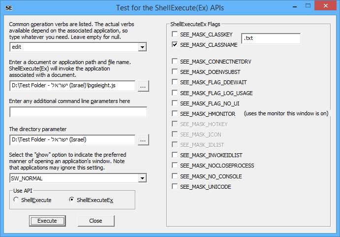

# ShellExec
A Windows GUI program to exercise the [ShellExecute](https://learn.microsoft.com/en-us/windows/win32/api/shellapi/nf-shellapi-shellexecutea)/[ShellExecuteEx](https://learn.microsoft.com/en-us/windows/win32/api/shellapi/nf-shellapi-shellexecuteexa) APIs.

The UI lets you choose many of the parameters to the API calls, and then executes the API.

I've found this a surprisingly useful test program for exercising the ShellExecute(Ex) APIs. It lets you easily test how an application behaves with different verbs.

As you can see from the screenshot, there are 4 string UI fields that correspond to the 4 string parameters of the Windows ShellExecute API, and the fifth UI field allows you to choose one of the SW_* values.
